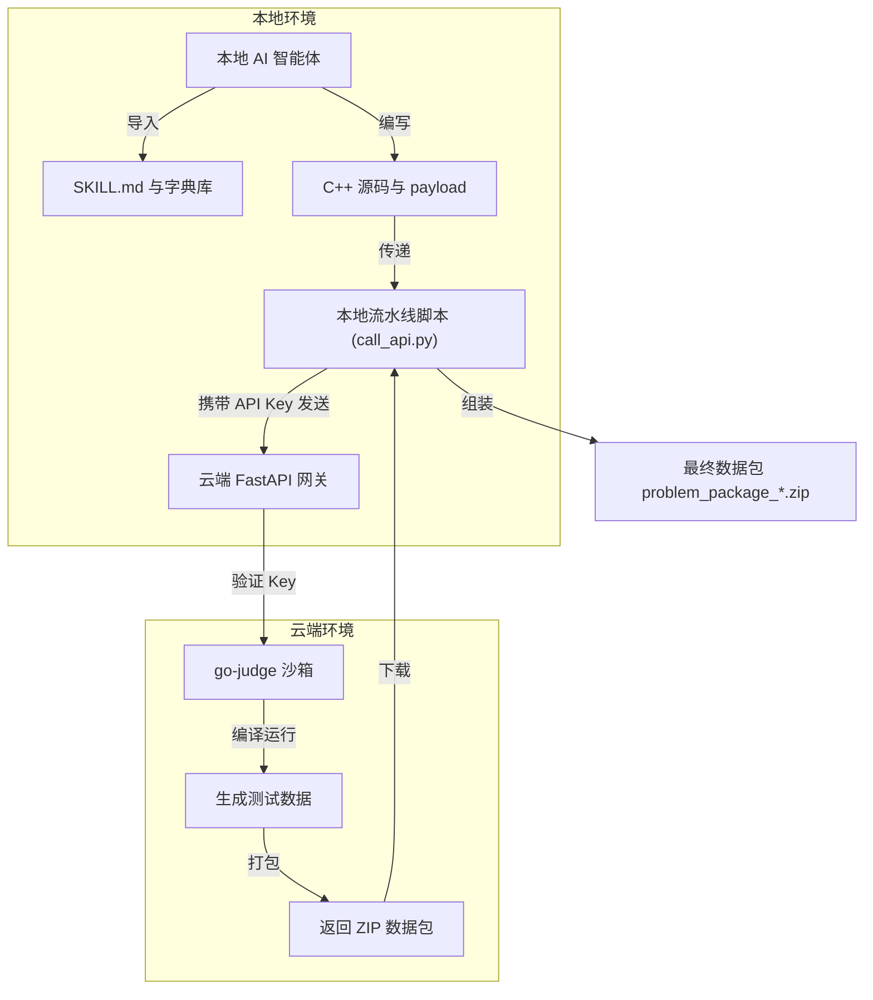

# 🔥 API Problem Generator

> 工业级 AI 信奥出题引擎 —— 大模型 × 云端沙箱 × 自动化流水线

[](https://www.python.org/)
[](https://fastapi.tiangolo.com/)
[](https://github.com/criyle/go-judge)
[](https://en.cppreference.com/w/cpp/14)
[](LICENSE)

## 📖 项目简介

`API Problem Generator` 是一款**工业级信息学奥林匹克（NOIP/CSP）AI 出题引擎**。它将大语言模型的推理能力与高强度沙箱的编译/数据生成能力深度融合，实现从"原题描述"到"完整数据包"的**全自动化流水线**。

## 🧠 核心架构图解



### 架构说明

- **本地 AI 智能体**：导入 `SKILL.md` 指令集和 `references/` 字典库，生成 C++ 源码和 `test_payload.json`
- **本地流水线脚本**：读取 payload，携带 API Key 调用云端 API，下载并组装最终数据包
- **云端 FastAPI 网关**：验证 API Key，调用 go-judge 沙箱执行编译和数据生成
- **go-judge 沙箱**：Docker 化部署，资源隔离，执行 C++ 编译、测试数据生成、校验

---

## 🚀 模块一：云端算力部署 (API Deployment)

**目标受众**：平台管理员/开发者

### 前置要求

- Linux 服务器（推荐 2C4G 或更高）
- Ubuntu 20.04+ / Debian 10+
- Root 权限或 sudo 权限

### 部署步骤

1. **准备部署文件**
   - 将项目中的 `backend/` 目录、`docker-compose.yml` 和 `deploy.sh` 复制到服务器任意目录

2. **执行一键部署**
   ```bash
   chmod +x deploy.sh
   ./deploy.sh
   ```

3. **部署过程**
   - 自动安装系统依赖（curl, wget, git, python3, pip）
   - 配置 Python 虚拟环境并安装 FastAPI 依赖
   - 构建并启动 go-judge Docker 沙箱
   - **自动生成随机 API Key**（请务必保存）
   - 配置 FastAPI Systemd 守护进程

4. **部署完成**
   ```
   🎉 部署彻底完成！系统已上线！
   🌐 API 访问地址: http://<你的服务器IP>:8000/api/forge_problem
   🔑 您的 API Key: <自动生成的 16 位随机 Key>
   ⚠️ (请务必妥善保存上方 Key，本地客户端调用时需将其作为参数传入)
   ```

5. **日常运维**
   ```bash
   # 查看服务状态
   sudo systemctl status cloud-judge-api
   
   # 查看实时日志
   sudo journalctl -u cloud-judge-api -f
   
   # 重启服务
   sudo systemctl restart cloud-judge-api
   ```

---

## 🧠 模块二：AI 技能导入与使用 (SKILL Usage)

**目标受众**：最终用户（出题老师）

### 零代码、零环境安装

1. **提取极简资产**
   - 从本仓库下载以下文件/目录到本地一个空文件夹：
     - `SKILL.md`（AI 指令集）
     - `scripts/` 目录（包含 `call_api.py` 客户端）
     - `references/` 目录（包含字典库和模板）

2. **工具挂载**
   - 使用支持工作区上下文的 AI 智能体工具（如 Workbuddy、Trae、Cursor 等）
   - 将上述文件放入工具的工作区目录

3. **与 AI 交互**
   - **步骤 1**：告诉 AI 当前环境的 API 网址和 Key
     ```
     当前云端地址是 http://<服务器IP>:8000/api/forge_problem，密钥是 <你的 API Key>
     ```
   
   - **步骤 2**：给出原题描述，让 AI 开始执行
     ```
     请根据以下原题描述生成一道新的类似题目：
     [这里粘贴原题描述]
     ```
   
   - **步骤 3**：AI 自动执行
     - 读取 `SKILL.md` 指令集
     - 检索 `references/` 字典库和模板
     - 生成 C++ 源码（gen.cpp、valid.cpp、std.cpp）
     - 生成 `test_payload.json` 和 `meta.json`
     - 自动执行：
       ```bash
       python3 scripts/call_api.py --url "<API 地址>" --key "<API Key>"
       ```
     - 在本地生成最终数据包：`problem_package_<timestamp>.zip`

---

## 📂 目录结构

```
api-problem-generator/
├── SKILL.md              # 本地用：AI 指令集（核心）
├── scripts/              # 本地用：客户端脚本
│   └── call_api.py       # 本地用：携带 API Key 调用云端
├── references/           # 本地用：字典库与模板
│   ├── Algorithm_Tags.md    # 本地用：算法标签字典
│   ├── backgrounds.md       # 本地用：背景世界观素材
│   ├── testlib-manual.md    # 本地用：testlib API 手册
│   └── templates/            # 本地用：生成器/校验器模板
│       ├── generators/     # 本地用：图/树/网格等生成器
│       └── validators/      # 本地用：数据校验器
├── backend/              # 云端用：FastAPI 服务
│   ├── main.py          # 云端用：核心 API 逻辑（认证、编译、生成）
│   ├── requirements.txt  # 云端用：Python 依赖
│   └── testlib.h        # 云端用：testlib 标准库
├── docker-compose.yml    # 云端用：go-judge 沙箱编排
├── Dockerfile.judge     # 云端用：go-judge 沙箱镜像
├── deploy.sh             # 云端用：一键部署脚本
├── README.md             # 项目文档
└── .gitignore            # Git 忽略配置
```

### 关键文件说明

| 文件/目录 | 用途 | 适用环境 |
|-----------|------|----------|
| `SKILL.md` | AI 指令集，定义出题流程和铁律 | 本地 |
| `scripts/call_api.py` | 本地客户端，携带 API Key 调用云端 | 本地 |
| `references/` | 字典库和模板，供 AI 检索 | 本地 |
| `backend/` | 云端 FastAPI 服务 | 云端 |
| `docker-compose.yml` | go-judge 沙箱编排 | 云端 |
| `deploy.sh` | 一键部署脚本 | 云端 |

---

## ⚠️ 注意事项

1. **API Key 安全**
   - 部署时自动生成的 API Key 是访问云端服务的唯一凭证
   - 请务必妥善保存，不要泄露给未授权人员
   - 如 Key 泄露，请重新部署或修改 Systemd 服务文件中的 `API_KEY` 环境变量

2. **自定义字典库**
   - 可以在 `references/` 目录中自定义：
     - `backgrounds.md`：添加自己的背景世界观
     - `Algorithm_Tags.md`：扩展算法标签
     - `templates/`：添加自定义生成器/校验器模板

3. **性能与资源**
   - 云端服务器推荐 2C4G 或更高配置
   - go-judge 沙箱会占用一定 CPU 和内存资源
   - 生成大数据时可能需要较长时间，请耐心等待

4. **网络要求**
   - 本地客户端需要能访问云端 API 地址
   - 云端服务器需要开放 8000 端口（可在 `deploy.sh` 中修改）

---

## 🤝 贡献

欢迎提交 Issue 和 Pull Request！

### 贡献方向

- 扩展 `references/` 字典库和模板
- 优化 go-judge 沙箱配置
- 改进 AI 指令集（`SKILL.md`）
- 增强错误处理和日志

---

## 📄 License

MIT License
